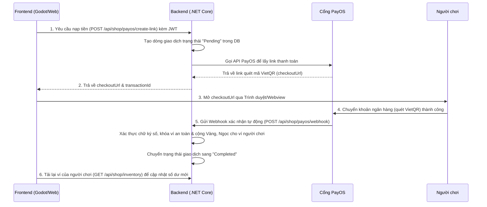

# Hướng Dẫn Vận Hành Backend & Tích Hợp Frontend (Sử Đại Việt)

Tài liệu này cung cấp hướng dẫn chi tiết dành cho lập trình viên Front-End (Web Admin & Game Client Godot) để tự khởi chạy Backend ở môi trường cục bộ (Local) và thực hiện kết nối, tích hợp cổng thanh toán tự động PayOS.

---

## 🛠️ 1. Hướng Dẫn Chạy Backend Dưới Local

Để chạy thử nghiệm và phát triển kiểm thử cục bộ:

### Yêu cầu hệ thống:
* Cài đặt **.NET 8.0 SDK** hoặc cao hơn (Tải từ Microsoft).
* Hệ cơ sở dữ liệu PostgreSQL (Hiện tại dự án đã kết nối trực tiếp đến Cloud Supabase Database nên bạn không cần cài thêm PostgreSQL ở máy cục bộ).

### Các bước khởi chạy:
1. Mở thư mục dự án Backend: `Sử Đại Việt` bằng Visual Studio / Rider hoặc qua Terminal.
2. Kiểm tra file cấu hình [appsettings.json](file:///Sử%20Đại%20Việt/appsettings.json) tại thư mục `Sử Đại Việt/Sử Đại Việt/appsettings.json` để xác minh các API Key của Supabase và PayOS Sandbox đã được điền đầy đủ.
3. Chạy lệnh khôi phục thư viện và khởi động:
   ```bash
   # Di chuyển vào thư mục chứa code
   cd "Sử Đại Việt/Sử Đại Việt"
   
   # Restore các NuGet package và khởi chạy ứng dụng
   dotnet run
   ```
4. Sau khi khởi động thành công:
   * **URL API Local:** `http://localhost:5042` hoặc `https://localhost:7037`
   * **Trang tài liệu Swagger UI:** `http://localhost:5042/swagger` (Bạn có thể mở link này trên trình duyệt để xem, thử nghiệm và chạy thử trực tiếp các API của hệ thống).

---

## ☁️ 2. Trạng Thái Triển Khai Trên Cloud (Render)

Hệ thống Backend đã được cấu hình tự động tích hợp CI/CD và đang chạy trực tiếp trên máy chủ đám mây của Render:
* **Base URL Cloud:** `https://be-sudaiviet.onrender.com`
* **API Kiểm tra sức khỏe (Health Check):** `https://be-sudaiviet.onrender.com/health` (Trả về HTTP 200 `Healthy` tức hệ thống đã kết nối hoàn hảo với database).

---

## 🔌 3. Hướng Dẫn Tích Hợp Cho Frontend (FE)

### 3.1 Cấu hình URL cơ sở
Trong mã nguồn FE (ví dụ file `.env` hoặc cấu hình global), thiết lập địa chỉ gọi BE tương ứng:
* **Local Test:** `http://localhost:5042`
* **Production/Staging Test:** `https://be-sudaiviet.onrender.com`

### 3.2 Xác thực Người chơi (Authentication)
Tất cả các API mua sắm cửa hàng hoặc tạo link thanh toán nạp tiền đều yêu cầu quyền truy cập của người chơi:
1. Đăng nhập người chơi bằng thư viện client Supabase ở phía FE.
2. Lấy mã **JWT Access Token** của session hiện tại từ Supabase.
3. Đính kèm mã token này vào Header của mỗi request gửi lên BE dưới dạng:
   ```http
   Authorization: Bearer <SUPABASE_JWT_ACCESS_TOKEN>
   ```

---

## 💳 4. Luồng Thanh Toán Tự Động Qua PayOS

### Sơ đồ luồng hoạt động:


### Chi tiết các API cần tích hợp:

#### 1. Tạo Link Thanh Toán
* **Endpoint:** `POST /api/shop/payos/create-link`
* **Headers:**
  * `Content-Type: application/json`
  * `Authorization: Bearer <MÃ_JWT_TOKEN_CỦA_NGƯỜI_CHƠI>`
* **Body:**
  ```json
  {
    "amountVnd": 50000
  }
  ```
  *(Lưu ý: Số tiền nạp tối thiểu là 2,000 VND theo quy định của ngân hàng).*
* **Response (Thành công - HTTP 200 OK):**
  ```json
  {
    "message": "Tạo link thanh toán thành công!",
    "checkoutUrl": "https://pay.payos.vn/web/...", // Đường dẫn mở cho người dùng quét mã
    "transactionId": 12,                              // Mã số giao dịch để đối chiếu
    "amountVnd": 50000,
    "status": "Pending"
  }
  ```

#### 2. Mở Trang Thanh Toán Ở FE
* **Đối với Web (React/Vue/HTML5):**
  ```javascript
  window.open(response.data.checkoutUrl, '_blank');
  ```
* **Đối với Game Client (Godot GDScript):**
  ```gdscript
  OS.shell_open(response_data["checkoutUrl"])
  ```

#### 3. Lấy lại Số dư ví mới sau khi nạp thành công
Sau khi người dùng hoàn tất thanh toán trên cổng PayOS, ví sẽ được cộng tự động ở Backend qua Webhook. Frontend chỉ cần gọi API sau để tải lại số dư mới nhất của người chơi để hiển thị lên UI:
* **Endpoint:** `GET /api/shop/inventory`
* **Headers:** `Authorization: Bearer <MÃ_JWT_TOKEN>`
* **Response (Trả về danh sách rương đồ kèm số lượng vàng/ngọc mới nhất).**

---

## 🛠️ 5. Ví Dụ Đoạn Mã Tích Hợp Mẫu

### Web Javascript (Axios):
```javascript
import axios from 'axios';

const api = axios.create({
  baseURL: 'https://be-sudaiviet.onrender.com'
});

async function handleTopup(amountVnd, jwtToken) {
  try {
    const res = await api.post('/api/shop/payos/create-link', 
      { amountVnd },
      { headers: { 'Authorization': `Bearer ${jwtToken}` } }
    );
    // Mở trang VietQR thanh toán
    window.open(res.data.checkoutUrl, '_blank');
  } catch (err) {
    console.error("Lỗi khi tạo link nạp tiền:", err.response?.data || err.message);
  }
}
```

### Game Client Godot (GDScript):
```gdscript
extends Node

const BE_URL = "https://be-sudaiviet.onrender.com"
var http: HTTPRequest

func _ready():
    http = HTTPRequest.new()
    add_child(http)
    http.request_completed.connect(_on_completed)

func start_topup_payment(amount: int, jwt: String):
    var headers = [
        "Content-Type: application/json",
        "Authorization: Bearer " + jwt
    ]
    var body = JSON.stringify({ "amountVnd": amount })
    http.request(BE_URL + "/api/shop/payos/create-link", headers, HTTPClient.METHOD_POST, body)

func _on_completed(result, response_code, headers, body):
    if response_code == 200:
        var res = JSON.parse_string(body.get_string_from_utf8())
        OS.shell_open(res["checkoutUrl"])
    else:
        print("Lỗi tạo hóa đơn nạp tiền!")
```
