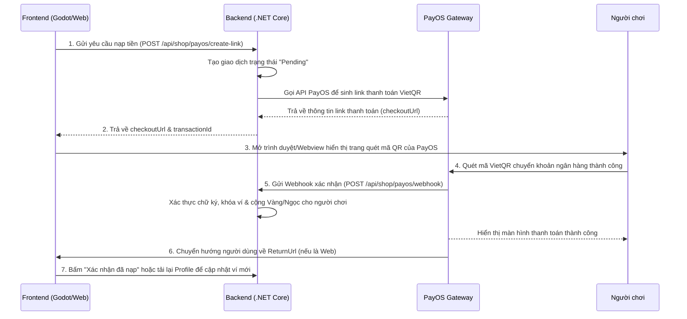

# Hướng dẫn tích hợp thanh toán PayOS cho Frontend (FE)

Tài liệu này hướng dẫn cách gọi API từ Frontend (Web hoặc Client Game Godot) để thực hiện luồng nạp tiền và đồng bộ số dư tài khoản qua cổng thanh toán PayOS.

---

## 1. Luồng thanh toán (Payment Flow)



---

## 2. Chi tiết API dành cho Frontend

### 2.1. API Tạo Link Thanh Toán (Create Payment Link)

API này dùng để gửi số tiền muốn nạp lên hệ thống, BE sẽ khởi tạo giao dịch chờ duyệt và trả về link thanh toán quét mã QR.

* **Endpoint**: `POST /api/shop/payos/create-link`
* **Headers**:
  - `Content-Type: application/json`
  - `Authorization: Bearer <JWT_TOKEN_CỦA_NGƯỜI_DÙNG>`
* **Request Body**:
```json
{
  "amountVnd": 50000
}
```
*(Lưu ý: Số tiền nạp tối thiểu là **2,000 VND** và tối đa là **100,000,000 VND** theo quy định của PayOS).*

* **Response (Thành công - HTTP 200 OK)**:
```json
{
  "message": "Tạo link thanh toán thành công!",
  "checkoutUrl": "https://img.vietqr.io/image/...", // Đường dẫn trang quét mã QR thanh toán của PayOS
  "transactionId": 12,                              // Mã giao dịch nội bộ của hệ thống
  "amountVnd": 50000,                               // Số tiền nạp
  "status": "Pending"                               // Trạng thái giao dịch
}
```

* **Xử lý ở FE**: 
  - Mở link `checkoutUrl` bằng trình duyệt ngoài hoặc Webview để người dùng quét mã thanh toán.
  - Ví dụ trong Godot GDScript:
    ```gdscript
    OS.shell_open(response_json["checkoutUrl"])
    ```

---

### 2.2. Webhook nhận kết quả thanh toán từ PayOS (Không gọi từ FE)

Khi người dùng chuyển khoản thành công, hệ thống PayOS sẽ tự động gọi trực tiếp vào API này của BE để cập nhật tiền. **Frontend không được tự ý gọi API này.**

* **Endpoint**: `POST /api/shop/payos/webhook`
* **Cấu hình trên PayOS Dashboard**: 
  - Đăng nhập vào trang quản trị PayOS.
  - Vào phần **Cấu hình Webhook** và điền URL: `https://<ten-mien-cua-ban>.com/api/shop/payos/webhook`.
  - Copy mã **Checksum Key** điền vào `appsettings.json` của BE để phục vụ xác thực bảo mật.

---

## 3. Ví dụ Code GDScript cho Game Godot (Frontend)

Dưới đây là ví dụ cách viết code gửi yêu cầu nạp tiền trong Godot:

```gdscript
extends Node

const CREATE_LINK_URL = "https://be-sudaiviet.onrender.com/api/shop/payos/create-link"
var http_request: HTTPRequest

func _ready():
    http_request = HTTPRequest.new()
    add_child(http_request)
    http_request.request_completed.connect(_on_request_completed)

# Gọi hàm này khi người chơi bấm nút "Nạp 50,000 VND"
func request_topup(amount: int, jwt_token: string):
    var headers = [
        "Content-Type: application/json",
        "Authorization: Bearer " + jwt_token
    ]
    var body = JSON.stringify({
        "amountVnd": amount
    })
    
    var error = http_request.request(CREATE_LINK_URL, headers, HTTPClient.METHOD_POST, body)
    if error != OK:
        push_error("Lỗi gửi HTTP Request: " + str(error))

func _on_request_completed(result, response_code, headers, body):
    if response_code == 200:
        var json = JSON.new()
        json.parse(body.get_string_from_utf8())
        var response_data = json.get_data()
        
        var checkout_url = response_data["checkoutUrl"]
        print("Mở trang thanh toán: ", checkout_url)
        
        # Mở trình duyệt ngoài cho người dùng thanh toán
        OS.shell_open(checkout_url)
    else:
        print("Tạo link thanh toán thất bại, mã lỗi: ", response_code)
```
